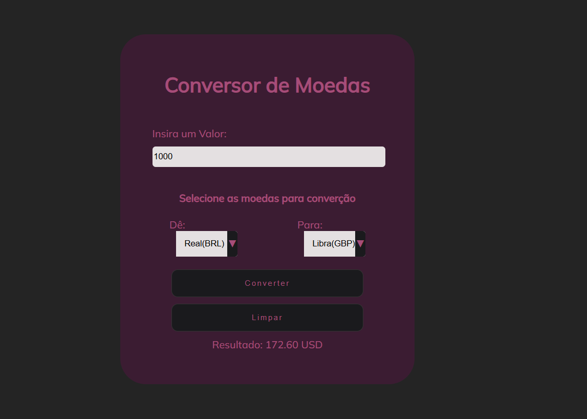

# Conversor de Moedas - Versão 2.0 :octocat:


<p align="center">
  <a href="#coffee-sobre">Sobre:</a> &#xa0; | &#xa0; 
  <a href="#globe_with_meridians">Funcionalidades:</a> &#xa0; | &#xa0;
  <a href="#page_facing_up">API Utilizada:</a> &#xa0; | &#xa0;
  <a href="#cloud">Como A API e Utilizada:</a> &#xa0; | &#xa0;
  <a href="#Estrutura de Código"> Estrutura do codigo:</a> &#xa0; | &#xa0;
  <a href="Como-Usar">Como Usar:</a> &#xa0; | &#xa0;
  <a href="Tecnologias-Utilizadas">Tecnologias Utilizadas:</a> &#xa0; | &#xa0;
  <a href="Desenvolvedores">Desenvolvedores:</a> &#xa0; | &#xa0;
</p>


### :coffee: Sobre:
Este projeto é a segunda versão do Conversor Simples, desenvolvido durante a disciplina de Desenvolvimento Web. O objetivo é fornecer um conversor de moedas em tempo real, utilizando valores de taxa de câmbio atualizados através de uma API externa. Nesta aplicação, é possível converter entre as moedas: Real (BRL), Dólar Americano (USD), Euro (EUR) e Libra Esterlina (GBP).

### :globe_with_meridians: Funcionalidades:
- **Conversão de Moedas em Tempo Real:** Os usuários podem inserir um valor, escolher a moeda de origem e a moeda de destino para obter o valor convertido instantaneamente.
- **Seleção de Moedas:** Interface intuitiva para selecionar moedas e valores.
- **Interface Limpa e Responsiva:** Layout projetado para proporcionar uma experiência de usuário agradável e simplificada.

### :page_facing_up: API Utilizada:
Esta aplicação utiliza a ExchangeRate API para obter taxas de câmbio atualizadas. A API permite realizar consultas de taxas de câmbio de várias moedas e oferece dados de conversão em tempo real.

### :cloud: Como a API é Utilizada:
- **Chave de API:** O sistema utiliza uma chave de API (apiKey) que deve ser substituída pelo usuário para o correto funcionamento da aplicação.
- **Requisição de Dados:** Ao selecionar a moeda de origem e destino, o sistema faz uma requisição fetch para a API, enviando o tipo de moeda de origem e recebendo as taxas de conversão para a moeda de destino.
- **Exibição dos Dados:** Após a conversão, o resultado é exibido no campo "conversão" na interface do usuário.

### Estrutura de Código

|HTML5|CSS|
|---|--|
|Campo de Valor: Onde o usuário insere o valor a ser convertido.| Estilos Customizados: Estilo responsivo e flexível utilizando variáveis de cor e layout, que proporcionam uma interface limpa e agradável.|
|Seleção de Moedas: Combinação de seletores select para escolher as moedas de origem e destino.| Botões e Formulários: Animações para botões e estilização dos campos de formulário para melhorar a experiência do usuário.  |
|Botões de Ação: Botão de "Converter" e botão de "Limpar".| 

#

#### JavaScript
O JavaScript implementa a funcionalidade principal da aplicação, com destaque para:

**Consulta de API:**

````
javascript
async function getExchangeRates(ofCoins, forCoins) {
    try {
        const response = await fetch(`${apiUrl}${ofCoins}`);
        const data = await response.json();
        if (data.result === "success") {
            return data.conversion_rates[forCoins];
        } else {
            throw new Error("Erro ao buscar taxa de câmbio");
        }
    } catch (error) {
        console.error("Error", error);
        return null;
    }
}

````

**Evento de Conversão:**

O evento submit é capturado pelo formulário, interrompendo a recarga padrão da página para processar a conversão de forma assíncrona. A taxa de câmbio é obtida e multiplicada pelo valor fornecido, exibindo o resultado na interface.

````
javascript
document.getElementById("Form-convert").addEventListener("submit", async function (event) {
    event.preventDefault();
    const value = parseFloat(document.getElementById("value-amount").value);
    const ofCoins = document.getElementById("ofCoins").value;
    const forCoins = document.getElementById("forCoins").value;
    const ExchangeRate = await getExchangeRates(ofCoins, forCoins);

    if(ExchangeRate) {
        const convertedValue = value * ExchangeRate;
        document.getElementById("conversao").textContent = `Resultado: ${convertedValue.toFixed(2)} ${forCoins}`;
    } else {
        alert("Error fetching quote, Please try again");
    }
});
````

### Como Usar:
> 1. Clone este repositório.

> 2. Insira sua chave de API em const apiKey = 'YOUR_API_KEY_HERE'; no arquivo JavaScript.

> 3. Abra o arquivo index.html em um navegador.

> 4. Insira o valor, escolha as moedas de origem e destino e clique em "Converter" para obter o valor convertido.

### Tecnologias Utilizadas

|Tecnologias | Uso |
|:--------:| ----- |
|| Ambiente de desenvolvimento do projeto |
||Estrutura do projeto |
|| Estilização do projeto|
| | Validações e animações|
| | Histórico de versão |
|| Armazenamento do projeto |
|**Live Server** | Extensão para reload de página em tempo real |


## Desenvolvedores:
[Leonardo Rocha](): Desenvolvedor do Código JavaScript.

[Chrystian](): Documentação do projeto e desenvolvimento da estrutura html e css.

